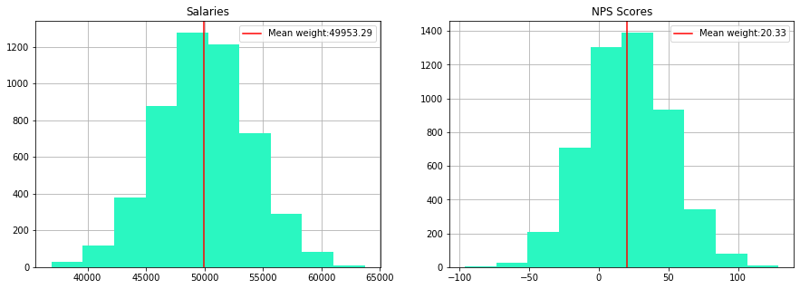
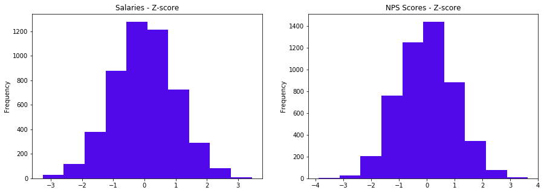
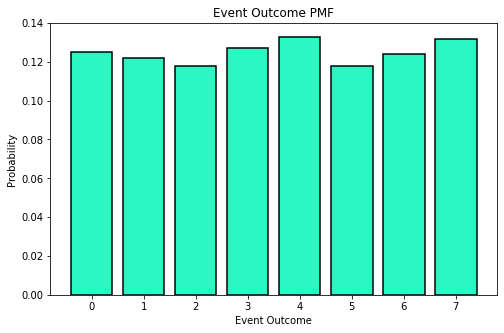
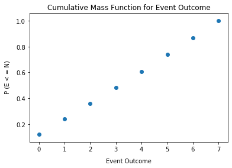

# Objectives
YW
* scrape a website for relevant information, store that information to a dataframe and save that dataframe as a csv file
* load in a dataframe and do the following
    * calculate the zscores of a given column
    * calculate the zscores of a point from a given column in the dataframe
    * calculate and plot the pmf and cdf of another column

# Part 1 - Webscraping
* use the following url scrape the first page of results
* for each item get the name of the item
* store the names to a dataframe and save that dataframe to csv then display
    * store the dataframe in the `data` folder in the repo
    * name the file `part1.csv` and make sure that when you write it you set `index=False`
* the head of the dataframe

* it should match the following


```python
from requests import get
url = "https://www.petsmart.com/dog/treats/dental-treats/#page_name=flyout&category=dog&cta=dentaltreat"

response = get(url)
print(response.text[:500])
```

    
    <!doctype html>
    <!--[if lt IE 7]> <html class="ie6 oldie" lang="en"> <![endif]-->
    <!--[if IE 7]> <html class="ie7 oldie" lang="en"> <![endif]-->
    <!--[if IE 8]> <html class="ie8 oldie" lang="en"> <![endif]-->
    <!--[if gt IE 8]><!--> <html lang="en"> <!--<![endif]-->
    <head>
    <script>
    dataLayer =
    [{
    'language': 'en',
    'loginState': false,
    'pageName':'ps:'productgridutils.getfirstparentname(pdict.productsearchresult.category):productgridutils.getsecondparentname(pdict.productsearchresult.category):den


```python
# scrape the data
import pandas as pd
from bs4 import BeautifulSoup
html_soup = BeautifulSoup(response.text, 'html.parser')


```


```python
dog_containers = html_soup.find_all('div', class_ = 'product-tile')

```


```python
dlist = []
for container in dog_containers:
    d ={}
    d['name'] = container.find('div', class_="product-name").text 
    dlist.append(d)

```


```python
# load the data ito a dataframe file
df_dogs = pd.DataFrame(dlist)
df_dogs.head()
```


<div>
<style scoped>
    .dataframe tbody tr th:only-of-type {
        vertical-align: middle;
    }

    .dataframe tbody tr th {
        vertical-align: top;
    }

    .dataframe thead th {
        text-align: right;
    }
</style>
<table border="1" class="dataframe">
  <thead>
    <tr style="text-align: right;">
      <th></th>
      <th>name</th>
    </tr>
  </thead>
  <tbody>
    <tr>
      <td>0</td>
      <td>\nGreenies Regular Dental Dog Treats\n</td>
    </tr>
    <tr>
      <td>1</td>
      <td>\nGreenies Petite Dental Dog Treats\n</td>
    </tr>
    <tr>
      <td>2</td>
      <td>\nGreenies Large Dental Dog Treats\n</td>
    </tr>
    <tr>
      <td>3</td>
      <td>\nPedigree Dentastix Large Dog Treats\n</td>
    </tr>
    <tr>
      <td>4</td>
      <td>\nGreenies 6 Month+ Puppy Petite Dental Dog Tr...</td>
    </tr>
  </tbody>
</table>
</div>


```python
# Cleaning names of Data
df_dogs.replace(r'\n',  ' ', regex=True,inplace=True)

```


```python
# save the data as a csv file
df_dogs.to_csv('data/part1.csv',index = False)
```


```python
# display df.head()
df_dogs.head()
```


<div>
<style scoped>
    .dataframe tbody tr th:only-of-type {
        vertical-align: middle;
    }

    .dataframe tbody tr th {
        vertical-align: top;
    }

    .dataframe thead th {
        text-align: right;
    }
</style>
<table border="1" class="dataframe">
  <thead>
    <tr style="text-align: right;">
      <th></th>
      <th>name</th>
    </tr>
  </thead>
  <tbody>
    <tr>
      <td>0</td>
      <td>Greenies Regular Dental Dog Treats</td>
    </tr>
    <tr>
      <td>1</td>
      <td>Greenies Petite Dental Dog Treats</td>
    </tr>
    <tr>
      <td>2</td>
      <td>Greenies Large Dental Dog Treats</td>
    </tr>
    <tr>
      <td>3</td>
      <td>Pedigree Dentastix Large Dog Treats</td>
    </tr>
    <tr>
      <td>4</td>
      <td>Greenies 6 Month+ Puppy Petite Dental Dog Tre...</td>
    </tr>
  </tbody>
</table>
</div>


# Part 2

load in the csv file located in the `data` folder called `part2.csv`

create a function that calculates the zscores of an array

then calculate the zscores for each column in part2.csv and add them as columns

See below for final result


```python
import numpy as np
```


```python
df = pd.read_csv('data/part2.csv')
df.head()
```


<div>
<style scoped>
    .dataframe tbody tr th:only-of-type {
        vertical-align: middle;
    }

    .dataframe tbody tr th {
        vertical-align: top;
    }

    .dataframe thead th {
        text-align: right;
    }
</style>
<table border="1" class="dataframe">
  <thead>
    <tr style="text-align: right;">
      <th></th>
      <th>salaries</th>
      <th>NPS Score</th>
      <th>eventOutcome</th>
    </tr>
  </thead>
  <tbody>
    <tr>
      <td>0</td>
      <td>44112.0</td>
      <td>-7.0</td>
      <td>1</td>
    </tr>
    <tr>
      <td>1</td>
      <td>46777.0</td>
      <td>-12.0</td>
      <td>2</td>
    </tr>
    <tr>
      <td>2</td>
      <td>50013.0</td>
      <td>50.0</td>
      <td>5</td>
    </tr>
    <tr>
      <td>3</td>
      <td>48983.0</td>
      <td>-13.0</td>
      <td>0</td>
    </tr>
    <tr>
      <td>4</td>
      <td>50751.0</td>
      <td>-11.0</td>
      <td>6</td>
    </tr>
  </tbody>
</table>
</div>


```python
def zscores(data):
    mu = data.mean()
    std = data.std()
    data_z = (data-mu)/std
    return data_z
```


```python
# calculate the zscore for each column and store them as a new column with the names used above
df['salaries_zscores'] = zscores(df['salaries'])
df['NPS Score_zscores'] = zscores(df['NPS Score'])
df['evenOutcome_zscores'] = zscores(df['eventOutcome'])
```


```python
df.head()
```


<div>
<style scoped>
    .dataframe tbody tr th:only-of-type {
        vertical-align: middle;
    }

    .dataframe tbody tr th {
        vertical-align: top;
    }

    .dataframe thead th {
        text-align: right;
    }
</style>
<table border="1" class="dataframe">
  <thead>
    <tr style="text-align: right;">
      <th></th>
      <th>salaries</th>
      <th>NPS Score</th>
      <th>eventOutcome</th>
      <th>salaries_zscores</th>
      <th>NPS Score_zscores</th>
      <th>evenOutcome_zscores</th>
    </tr>
  </thead>
  <tbody>
    <tr>
      <td>0</td>
      <td>44112.0</td>
      <td>-7.0</td>
      <td>1</td>
      <td>-1.460155</td>
      <td>-0.913522</td>
      <td>-1.103166</td>
    </tr>
    <tr>
      <td>1</td>
      <td>46777.0</td>
      <td>-12.0</td>
      <td>2</td>
      <td>-0.793981</td>
      <td>-1.080668</td>
      <td>-0.668095</td>
    </tr>
    <tr>
      <td>2</td>
      <td>50013.0</td>
      <td>50.0</td>
      <td>5</td>
      <td>0.014926</td>
      <td>0.991947</td>
      <td>0.637118</td>
    </tr>
    <tr>
      <td>3</td>
      <td>48983.0</td>
      <td>-13.0</td>
      <td>0</td>
      <td>-0.242545</td>
      <td>-1.114097</td>
      <td>-1.538237</td>
    </tr>
    <tr>
      <td>4</td>
      <td>50751.0</td>
      <td>-11.0</td>
      <td>6</td>
      <td>0.199405</td>
      <td>-1.047239</td>
      <td>1.072189</td>
    </tr>
  </tbody>
</table>
</div>


# Part 3 
plot 'salaries' and 'NPS Score' on a subplot (1 row 2 columns) 
then repeat this for the zscores

see image below for reference


```python
import matplotlib.pyplot as plt
import seaborn as sns
```


```python
# plot for salaries and NPS Score data goes here
myfigure = plt.figure(figsize = (15,5))


ax1 = myfigure.add_subplot(121)
ax2 = myfigure.add_subplot(122)

# df['salaries'].hist(ax=ax1, color = '#2af7c1')
df['salaries'].hist( ax=ax1, color = '#2af7c1',zorder = 2)
df['NPS Score'].hist( ax=ax2, color = '#2af7c1',zorder = 2)

ax1.set_title('Salaries')
ax2.set_title('NPS Scores')

ax1.axvline(df['salaries'].mean(), color = 'Red', label = "Mean weight:" + str(round(df['salaries'].mean(),2)));
ax2.axvline(df['NPS Score'].mean(), color = 'Red', label = "Mean weight:" + str(round(df['NPS Score'].mean(),2)));

ax1.legend()
ax2.legend()

plt.show()
```





```python
# plot for zscores for salaries and NPS Score data goes here
myfigure = plt.figure(figsize = (15,5))

ax1 = myfigure.add_subplot(121)
ax2 = myfigure.add_subplot(122)

df['salaries_zscores'].plot(kind='hist', ax=ax1, color = '#5109eb' )
df['NPS Score_zscores'].plot(kind='hist', ax=ax2, color = '#5109eb' )

ax1.set_title('Salaries - Z-score')
ax2.set_title('NPS Scores - Z-score')

plt.show()
```





# Part 4 - PMF
using the column 'eventOutcomes'

create a PMF and plot the PMF as a bar chart

See image below for referenc


```python
df['eventOutcome'].value_counts()
```


    4    666
    7    661
    3    636
    0    624
    6    622
    1    608
    2    592
    5    591
    Name: eventOutcome, dtype: int64


```python
eventcounter = {}
for event in df['eventOutcome']:
    eventcounter[event] = eventcounter.get(event,0)+1
eventcounter
```


    {1: 608, 2: 592, 5: 591, 0: 624, 6: 622, 4: 666, 3: 636, 7: 661}


```python
sum_events = sum(eventcounter.values())
sum_events
```


    5000


```python
pmf = list(map(lambda x: round(x/sum_events,3),eventcounter.values()))  
pmf
```


    [0.122, 0.118, 0.118, 0.125, 0.124, 0.133, 0.127, 0.132]


```python

plt.figure(figsize=(8,5))

plt.bar(eventcounter.keys(), pmf,zorder = 2, color = '#2af7c1', linewidth = 1.5, edgecolor ='k')

plt.title("Event Outcome PMF")
plt.xlabel('Event Outcome')
plt.ylabel('Probability')
plt.ylim(0,0.14)
plt.show()
```





# Part 5 - CDF
plot the CDF of Event Outcomes as a scatter plot using the information above

See image below for reference 


```python
import numpy as np
```


```python
cumsum = list(np.cumsum(pmf))
cumsum
events = sorted(list(eventcounter.keys()))
events
```


    [0, 1, 2, 3, 4, 5, 6, 7]


```python
plt.scatter(events,cumsum)
plt.xlabel("Event Outcome", labelpad=10)
plt.ylabel(" P (E < = N)", labelpad=10)
plt.title("Cumulative Mass Function for Event Outcome")
```


    Text(0.5, 1.0, 'Cumulative Mass Function for Event Outcome')





# Bonus:
* using np.where find salaries with zscores <= -2.0

* calculate the skewness and kurtosis for the NPS Score column


```python
# find salaries with zscores <= -2.0 
```


```python
z_scores = df['salaries_zscores']
z_scores
```


    0      -1.460155
    1      -0.793981
    2       0.014926
    3      -0.242545
    4       0.199405
              ...   
    4995    0.156660
    4996    1.143046
    4997   -0.954463
    4998   -0.682494
    4999   -0.510014
    Name: salaries_zscores, Length: 5000, dtype: float64


```python
salaries_z_under2 = list(np.where(z_scores <=-2)[0])
salaries_z_under2
```


    [20,
     41,
     89,
     107,
     285,
     286,
     291,
     303,
     338,
     399,
     408,
     411,
     415,
     445,
     454,
     489,
     554,
     570,
     640,
     658,
     687,
     690,
     746,
     767,
     781,
     784,
     792,
     839,
     873,
     915,
     962,
     977,
     1049,
     1113,
     1124,
     1173,
     1184,
     1197,
     1221,
     1246,
     1303,
     1306,
     1312,
     1337,
     1344,
     1360,
     1526,
     1565,
     1626,
     1646,
     1763,
     1764,
     1879,
     1931,
     1958,
     1966,
     1983,
     2013,
     2025,
     2052,
     2161,
     2314,
     2356,
     2391,
     2396,
     2452,
     2622,
     2630,
     2640,
     2685,
     2731,
     2802,
     2888,
     2894,
     2908,
     2965,
     2982,
     3036,
     3129,
     3173,
     3262,
     3287,
     3292,
     3293,
     3317,
     3379,
     3432,
     3445,
     3496,
     3546,
     3582,
     3646,
     3656,
     3708,
     3709,
     3761,
     3918,
     3953,
     4018,
     4038,
     4062,
     4116,
     4122,
     4155,
     4158,
     4168,
     4174,
     4181,
     4211,
     4276,
     4308,
     4341,
     4346,
     4448,
     4458,
     4506,
     4528,
     4571,
     4692,
     4707,
     4731,
     4765,
     4949]


```python
len(salaries_z_under2)
```


    123


```python
# Checking to see if they match up
df.loc[df['salaries_zscores'] < -2.0]
```


<div>
<style scoped>
    .dataframe tbody tr th:only-of-type {
        vertical-align: middle;
    }

    .dataframe tbody tr th {
        vertical-align: top;
    }

    .dataframe thead th {
        text-align: right;
    }
</style>
<table border="1" class="dataframe">
  <thead>
    <tr style="text-align: right;">
      <th></th>
      <th>salaries</th>
      <th>NPS Score</th>
      <th>eventOutcome</th>
      <th>salaries_zscores</th>
      <th>NPS Score_zscores</th>
      <th>evenOutcome_zscores</th>
    </tr>
  </thead>
  <tbody>
    <tr>
      <td>20</td>
      <td>39383.0</td>
      <td>47.0</td>
      <td>1</td>
      <td>-2.642269</td>
      <td>0.891659</td>
      <td>-1.103166</td>
    </tr>
    <tr>
      <td>41</td>
      <td>38063.0</td>
      <td>2.0</td>
      <td>5</td>
      <td>-2.972231</td>
      <td>-0.612658</td>
      <td>0.637118</td>
    </tr>
    <tr>
      <td>89</td>
      <td>41458.0</td>
      <td>65.0</td>
      <td>7</td>
      <td>-2.123578</td>
      <td>1.493386</td>
      <td>1.507260</td>
    </tr>
    <tr>
      <td>107</td>
      <td>40854.0</td>
      <td>27.0</td>
      <td>4</td>
      <td>-2.274561</td>
      <td>0.223074</td>
      <td>0.202047</td>
    </tr>
    <tr>
      <td>285</td>
      <td>40886.0</td>
      <td>43.0</td>
      <td>5</td>
      <td>-2.266562</td>
      <td>0.757942</td>
      <td>0.637118</td>
    </tr>
    <tr>
      <td>...</td>
      <td>...</td>
      <td>...</td>
      <td>...</td>
      <td>...</td>
      <td>...</td>
      <td>...</td>
    </tr>
    <tr>
      <td>4692</td>
      <td>38341.0</td>
      <td>37.0</td>
      <td>3</td>
      <td>-2.902739</td>
      <td>0.557366</td>
      <td>-0.233024</td>
    </tr>
    <tr>
      <td>4707</td>
      <td>41813.0</td>
      <td>96.0</td>
      <td>1</td>
      <td>-2.034839</td>
      <td>2.529693</td>
      <td>-1.103166</td>
    </tr>
    <tr>
      <td>4731</td>
      <td>41184.0</td>
      <td>21.0</td>
      <td>0</td>
      <td>-2.192071</td>
      <td>0.022498</td>
      <td>-1.538237</td>
    </tr>
    <tr>
      <td>4765</td>
      <td>40108.0</td>
      <td>43.0</td>
      <td>2</td>
      <td>-2.461040</td>
      <td>0.757942</td>
      <td>-0.668095</td>
    </tr>
    <tr>
      <td>4949</td>
      <td>38915.0</td>
      <td>13.0</td>
      <td>7</td>
      <td>-2.759255</td>
      <td>-0.244936</td>
      <td>1.507260</td>
    </tr>
  </tbody>
</table>
<p>123 rows × 6 columns</p>
</div>


```python
# Both have 123 entries
```


```python

```


```python
# calculate skewness and kurtosis of NPS Score column
```


```python
from scipy.stats import kurtosis, skew
```


```python
print ('Skewness =', skew(df['NPS Score']))
print ('kurtosis =', kurtosis(df['NPS Score']))
```

    Skewness = 0.02450527688165856
    kurtosis = -0.04212714461681166


```python

```

# run the cell below to convert your notebook to a README for assessment


```python
!jupyter nbconvert --to markdown assessment.ipynb && mv assessment.md README.md
```
